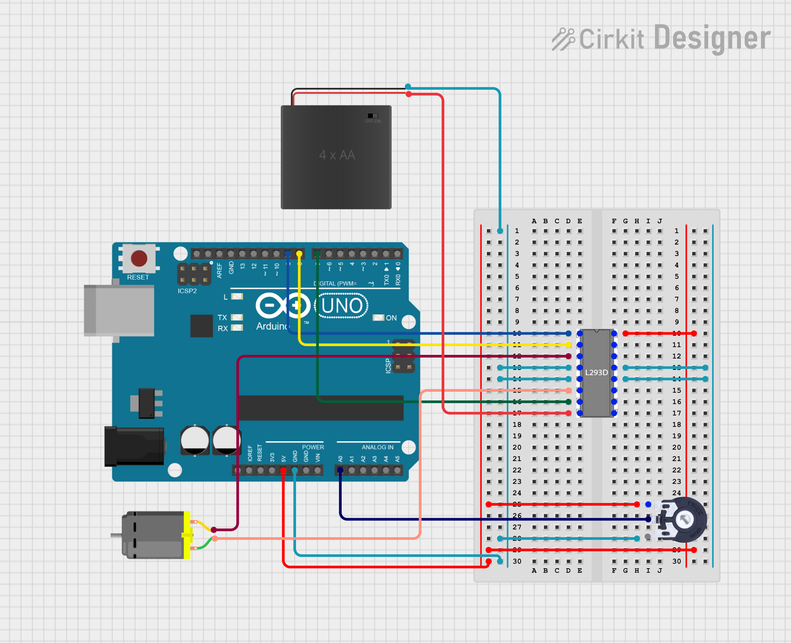
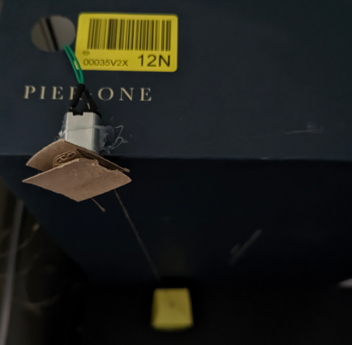

# Project: Arduino Elevator Control with L293D and Potentiometer

This project implements a DC motor control system for a model elevator using an Arduino Uno and an L293D H-Bridge. It features bidirectional movement and speed regulation, with a specialized software "kick-start" to overcome static friction at low speeds.

## Components Used
* Arduino Uno
* L293D H-Bridge IC
* DC Motor (Elevator Drive)
* 10k Ohm Potentiometer
* External Power Source (e.g., 6V-9V battery pack)
* Breadboard and Jumper Wires

## Circuit Diagram
The following diagram illustrates the wiring between the Arduino, the L293D driver, and the power sources.

### Pin Mapping
| Component | Arduino Pin | L293D Pin | Function |
| :--- | :--- | :--- | :--- |
| Potentiometer | A0 | - | Analog input for speed/direction |
| L293D Enable | 9 (PWM) | 1 | Motor speed control |
| L293D IN1 | 8 | 2 | Direction control A |
| L293D IN2 | 7 | 7 | Direction control B |
| Logic Power | 5V | 16 | VCC1 (Logic supply) |
| Motor Power | - | 8 | VCC2 (External supply +) |
| Ground | GND | 4, 5, 12, 13 | Common ground (GND) |

## How It Works
The system uses the potentiometer's center position as a neutral "Stop" point. Rotating the knob in either direction dictates the movement of the elevator.

### Bidirectional Control
The L293D H-Bridge allows the motor to spin in two directions by swapping the polarity across its outputs. When the potentiometer value is above a certain threshold, the motor spins forward; below a lower threshold, it reverses.

## Setup Instructions
1. Connect the L293D to the breadboard, ensuring it straddles the center notch.
2. Connect the Arduino 5V to L293D pin 16 and external battery (+) to L293D pin 8.
3. **Important:** Connect the external battery (-) to the Arduino GND pin to create a common ground reference.
4. Wire the potentiometer to 5V, GND, and A0.
5. Upload the control sketch to the Arduino.
6. Adjust the potentiometer to verify the elevator moves up and down smoothly.

